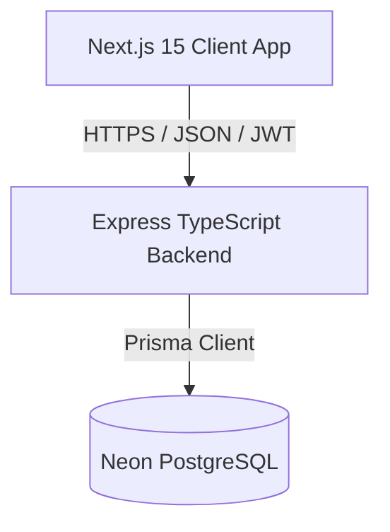

# Architecture Design Document - Loan Origination System (LOS)

This document provides a high-level view of the Loan Origination System (LOS) architecture, details our design decisions, and explains how backend services and frontend clients coordinate.

---

## 1. System Overview
The system follows a classic **client-server** architecture using a decoupled frontend and backend.

- **Frontend Client**: Next.js 15 App Router using React, Tailwind CSS, and ShadCN UI. Interacts with the backend via REST endpoints.
- **Backend API Server**: Express.js server running in TypeScript. Serves REST API routes and handles JWT authorization.
- **Database Layer**: Neon PostgreSQL managed instance accessed via Prisma ORM.

---

## 2. Backend Design Patterns
We follow the **Controller → Service → Repository** pattern to maintain a strict separation of concerns:

1. **Routing / Controllers**: Responsible for parsing request payloads, extracting URL parameters, running route-level validation, and matching routes to controllers.
2. **Services**: Contain the core business rules. They receive validated input from controllers, coordinate database transactions, and handle operations like password hashing or data encryption.
3. **Repositories**: Act as the data access abstraction layer. They encapsulate Prisma DB queries, shielding services from the raw database schema.
4. **Middlewares**: Process cross-cutting concerns like Auth check (JWT verification), Role check (RBAC), Global Exception Handling, and Request Body Schema Validation (Zod).

---

## 3. Data Protection & Security Architecture

### 3.1 AES-256-GCM Encryption
To protect sensitive personally identifiable information (PII) like PAN, Aadhaar numbers, and Bank Accounts, the backend uses symmetric authenticated encryption:
- **Algorithm**: `aes-256-gcm`
- **Key Generation**: 32-byte cryptographically secure key loaded from the environment (`ENCRYPTION_KEY`).
- **Initialization Vector (IV)**: 12-byte secure random IV generated per encryption run.
- **Auth Tag**: 16-byte authentication tag produced by GCM to guarantee ciphertext integrity.
- **Format**: Ciphertext is stored as `iv_hex:auth_tag_hex:ciphertext_hex`.

### 3.2 Password Security
- All passwords are hashed using **bcrypt** with a work factor of 10.
- Raw passwords are never logged, stored, or returned in API responses.

### 3.3 Authorization & Session Tokens (JWT)
- Stateless session tokens generated using standard JSON Web Tokens.
- Payload includes `id`, `email`, and `role`.
- Transmitted in the standard `Authorization: Bearer <TOKEN>` header.

---

## 4. Frontend Design Patterns
- **Next.js App Router**: Client-side pages are structured in the `/src/app` directory. Protected pages are grouped within `/dashboard` layout.
- **Service Layer**: All API communication is abstracted in `/src/services/api.ts`, which configures standard fetch headers (including the Authorization Bearer header).
- **Authentication Context (`AuthContext`)**: A React Context that manages login states, caches the current user profile, and exposes helpers for signing in and out.
- **Role-Aware Sidebar**: Reads the logged-in user's role from the context and dynamically constructs navigation links.

---

## 5. Phase 6 Customer Self-Service Portal Architecture
To isolate customer interactions from internal banking operations, we implement a strict sandboxed architecture:
- **Folder Isolation**:
  - Backend: `Backend/src/repositories/customer.repository.ts`, `Backend/src/services/customer.service.ts`, `Backend/src/controllers/customer.controller.ts`.
  - Frontend: `Frontend/src/app/customer/*` layout, login, dashboard, detail, documents, offers, notifications, and profile pages.
- **Data Access Boundary**: Every service-layer method queries the database using `customerUserId` in the where-clause of the query. Sensitive internal underwriting fields (risk category, credit score calculation, recommendation) are completely omitted from selects returned to customers.
- **Communication Flow**: Actions taken by customers (like document upload or offer acceptance) emit non-blocking `CustomerNotification` records, trigger real-time email alerts to the assigned Loan Officer, and update employee dashboards with pending badge indicators.

