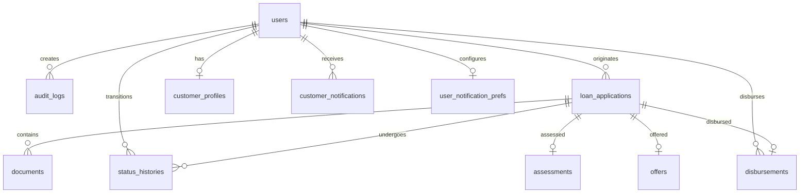

# Database Schema Document - Loan Origination System (LOS)

This document details the database schema and model definitions for Phase 2 of the Loan Origination System (LOS).

---

## 1. Entity Relationship Overview
The database uses a relational schema containing user records, system audit trail logs, detailed loan applications, associated documents, and status progression histories.

---

## 2. Table Definitions

### 2.1 Users (`users`)
Stores user profiles and role credentials.

| Field | Type | Constraints | Description |
| :--- | :--- | :--- | :--- |
| `id` | UUID (String) | Primary Key, Default UUID | Unique identifier. |
| `email` | String | Unique, Indexed | Login email. |
| `password` | String | Not Null | Bcrypt-hashed password. |
| `firstName` | String | Not Null | User's first name. |
| `lastName` | String | Not Null | User's last name. |
| `role` | Role (Enum) | Default `LOAN_OFFICER` | Role matching `SUPER_ADMIN`, `LOAN_OFFICER`, `CREDIT_ANALYST`, `APPROVER`, `CUSTOMER`. |
| `inviteStatus` | InviteStatus (Enum) | Nullable | State matching `INVITED`, `ACTIVE` for customer portal users. |
| `otpHash` | String | Nullable | Temp OTP verification code hash. |
| `otpExpiry` | DateTime | Nullable | Verification code expiration. |
| `isActive` | Boolean | Default `true` | System access toggle. |
| `createdAt` | DateTime | Default `now()` | Record creation timestamp. |
| `updatedAt` | DateTime | Auto Update | Last modification timestamp. |

---

### 2.2 Audit Logs (`audit_logs`)
Tracks user actions across the system.

| Field | Type | Constraints | Description |
| :--- | :--- | :--- | :--- |
| `id` | UUID (String) | Primary Key, Default UUID | Unique identifier. |
| `userId` | UUID (String) | Foreign Key -> `users.id`, SetNull on delete | User who triggered the action. |
| `action` | String | Not Null | Short description of action (e.g. `LOAN_APPLICATION_CREATE`). |
| `details` | String | Not Null | Detailed explanation / metadata. |
| `ipAddress` | String | Nullable | Client IP address. |
| `createdAt` | DateTime | Default `now()` | Log generation timestamp. |

---

### 2.3 Loan Applications (`loan_applications`)
Contains customer profile details and loan financial figures.

| Field | Type | Constraints | Description |
| :--- | :--- | :--- | :--- |
| `id` | UUID (String) | Primary Key, Default UUID | Unique identifier. |
| `applicationNumber` | String | Unique, Indexed | Serial format: `LOS-YYYY-000001`. |
| `applicantName` | String | Not Null | Customer's full name. |
| `email` | String | Not Null | Customer's email. |
| `phone` | String | Not Null | Customer's phone number. |
| `panEncrypted` | String | Not Null | Encrypted PAN (AES-256-GCM) at rest. |
| `loanType` | LoanType (Enum) | Not Null | `PERSONAL`, `HOME`, `AUTO`, `BUSINESS`, `EDUCATION`. |
| `loanAmount` | Float | Not Null | Requested loan limit. |
| `monthlyIncome` | Float | Not Null | Net monthly income. |
| `employmentType` | EmploymentType (Enum) | Not Null | `SALARIED`, `SELF_EMPLOYED`, `BUSINESS_OWNER`. |
| `status` | LoanStatus (Enum) | Default `DRAFT` | `DRAFT`, `SUBMITTED`, `UNDER_REVIEW`, `APPROVED`, `OFFER_GENERATED`, `OFFER_ACCEPTED`, `REJECTED`, `DISBURSED`. |
| `userId` | UUID (String) | Foreign Key -> `users.id` | Loan Officer who created the application. |
| `customerUserId` | UUID (String) | Foreign Key -> `users.id` | Customer portal user owning the application. |
| `createdAt` | DateTime | Default `now()` | Record creation timestamp. |
| `updatedAt` | DateTime | Auto Update | Last modification timestamp. |

---

### 2.4 Documents (`documents`)
Reference registry for uploaded customer verification assets.

| Field | Type | Constraints | Description |
| :--- | :--- | :--- | :--- |
| `id` | UUID (String) | Primary Key, Default UUID | Unique identifier. |
| `applicationId` | UUID (String) | Foreign Key -> `loan_applications.id`, Cascade | Associated loan case. |
| `documentType` | DocumentType (Enum) | Not Null | `PAN`, `AADHAAR`, `SALARY_SLIP`, `BANK_STATEMENT`. |
| `originalName` | String | Not Null | Original registered filename. |
| `publicId` | String | Unique, Not Null | Cloudinary unique asset identifier. |
| `secureUrl` | String | Not Null | Cloudinary HTTPS direct asset link. |
| `status` | DocumentStatus (Enum) | Default `PENDING` | `PENDING`, `VERIFIED`, `REJECTED`. |
| `uploadedById` | UUID (String) | Foreign Key -> `users.id` | User who uploaded the document. |
| `uploadedAt` | DateTime | Default `now()` | Timestamp of upload registration. |

---

### 2.5 Status Histories (`status_histories`)
Immutable audit trail records tracking application workflow transitions.

| Field | Type | Constraints | Description |
| :--- | :--- | :--- | :--- |
| `id` | UUID (String) | Primary Key, Default UUID | Unique identifier. |
| `applicationId` | UUID (String) | Foreign Key -> `loan_applications.id`, Cascade | Associated loan case. |
| `oldStatus` | LoanStatus (Enum) | Nullable | Source state (null for initial draft creation). |
| `newStatus` | LoanStatus (Enum) | Not Null | Destination state. |
| `changedById` | UUID (String) | Foreign Key -> `users.id`, Cascade | User who updated the status. |
| `changedAt` | DateTime | Default `now()` | Timestamp of transition execution. |

---

### 2.6 Assessments (`assessments`)
Risk underwriting metrics locked for evaluated loan applications.

| Field | Type | Constraints | Description |
| :--- | :--- | :--- | :--- |
| `id` | UUID (String) | Primary Key, Default UUID | Unique identifier. |
| `applicationId` | UUID (String) | Unique, Foreign Key -> `loan_applications.id`, Cascade | Associated loan application. |
| `status` | AssessmentStatus (Enum) | Default `PENDING` | Assessment status (`PENDING`, `COMPLETED`). |
| `creditScore` | Int | Not Null | Rule-calculated credit scoring. |
| `riskLevel` | RiskLevel (Enum) | Not Null | Low, Medium, High risk indicator. |
| `recommendation` | Recommendation (Enum) | Not Null | Approve, Manual Review, Reject recommendation. |
| `assessmentNotes` | String | Not Null | Analytical notes and reasoning. |
| `assessedById` | UUID (String) | Foreign Key -> `users.id`, Cascade | Credit analyst performing assessment. |
| `assessedAt` | DateTime | Default `now()` | Timestamp of lock execution. |

---

### 2.7 Offers (`offers`)
Credit terms and EMI schedules proposed to applicants.

| Field | Type | Constraints | Description |
| :--- | :--- | :--- | :--- |
| `id` | UUID (String) | Primary Key, Default UUID | Unique identifier. |
| `applicationId` | UUID (String) | Unique, Foreign Key -> `loan_applications.id`, Cascade | Associated loan application. |
| `loanAmount` | Float | Not Null | Approved loan principal. |
| `interestRate` | Float | Not Null | Annualized interest rate percentage. |
| `tenureMonths` | Int | Not Null | Repayment duration in months. |
| `emiAmount` | Float | Not Null | Calculated Monthly EMI installment. |
| `offerStatus` | OfferStatus (Enum) | Default `GENERATED` | State matching `GENERATED`, `ACCEPTED`, `DECLINED`. |
| `generatedAt` | DateTime | Default `now()` | Timestamp of offer lock. |
| `acceptedAt` | DateTime | Nullable | Client response record timestamp. |
| `expiresAt` | DateTime | Not Null | Expiry deadline (default 7 days validity). |

---

### 2.8 Disbursements (`disbursements`)
Payment releases and transaction clearing references.

| Field | Type | Constraints | Description |
| :--- | :--- | :--- | :--- |
| `id` | UUID (String) | Primary Key, Default UUID | Unique identifier. |
| `applicationId` | UUID (String) | Unique, Foreign Key -> `loan_applications.id`, Cascade | Associated loan application. |
| `amount` | Float | Not Null | Disbursed principal value. |
| `referenceNumber` | String | Unique | Payout txn: `TXN-YYYYMMDD-XXXXXX`. |
| `status` | DisbursementStatus (Enum) | Default `SUCCESS` | State matching `PENDING`, `SUCCESS`, `FAILED`. |
| `disbursedById` | UUID (String) | Foreign Key -> `users.id`, Cascade | Authorized approver releasing funds. |
| `disbursedAt` | DateTime | Default `now()` | Payout execution timestamp. |

---

### 2.9 Customer Profiles (`customer_profiles`)
Stores detailed demographic and nominee metadata for Customer accounts.

| Field | Type | Constraints | Description |
| :--- | :--- | :--- | :--- |
| `id` | UUID (String) | Primary Key, Default UUID | Unique identifier. |
| `userId` | UUID (String) | Unique, Foreign Key -> `users.id` | Customer user ID. |
| `address` | String | Nullable | Street address. |
| `city` | String | Nullable | Current city. |
| `state` | String | Nullable | Current state. |
| `postalCode` | String | Nullable | Pin code. |
| `nomineeName` | String | Nullable | Nominee details. |
| `nomineePhone` | String | Nullable | Nominee phone number. |
| `occupation` | String | Nullable | Job / profession. |
| `createdAt` | DateTime | Default `now()` | Record creation timestamp. |
| `updatedAt` | DateTime | Auto Update | Last modification timestamp. |

---

### 2.10 Customer Notifications (`customer_notifications`)
Stores notifications dispatched to portal users.

| Field | Type | Constraints | Description |
| :--- | :--- | :--- | :--- |
| `id` | UUID (String) | Primary Key, Default UUID | Unique identifier. |
| `userId` | UUID (String) | Foreign Key -> `users.id` | Targeted customer user. |
| `applicationId` | UUID (String) | Foreign Key -> `loan_applications.id` | Related application. |
| `type` | NotificationType (Enum) | Not Null | Types matching `APPLICATION_RECEIVED`, `OFFER_GENERATED`, `OFFER_ACCEPTED`, `OFFER_DECLINED`, `DOCUMENT_UPLOADED`, `LOAN_DISBURSED`. |
| `title` | String | Not Null | Display title. |
| `message` | String | Not Null | Display details. |
| `isRead` | Boolean | Default `false` | Read flag. |
| `createdAt` | DateTime | Default `now()` | Timestamp of generation. |

---

### 2.11 User Notification Preferences (`user_notification_prefs`)
Stores email notification preferences for users.

| Field | Type | Constraints | Description |
| :--- | :--- | :--- | :--- |
| `id` | UUID (String) | Primary Key, Default UUID | Unique identifier. |
| `userId` | UUID (String) | Unique, Foreign Key -> `users.id`, Cascade | User who owns the preferences. |
| `emailNotifications` | Boolean | Default `true` | Toggle for email dispatch. |
| `createdAt` | DateTime | Default `now()` | Record creation timestamp. |
| `updatedAt` | DateTime | Auto Update | Last modification timestamp. |

---

### 2.12 System Configuration (`system_config`)
Stores global system settings (e.g., global email toggle).

| Field | Type | Constraints | Description |
| :--- | :--- | :--- | :--- |
| `id` | UUID (String) | Primary Key, Default UUID | Unique identifier. |
| `key` | String | Unique | Setting key (e.g., `EMAIL_SERVICE_ENABLED`). |
| `value` | String | Not Null | String representation of the setting value. |
| `updatedAt` | DateTime | Auto Update | Last modification timestamp. |
