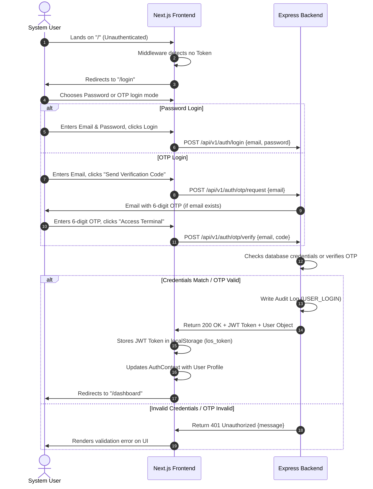
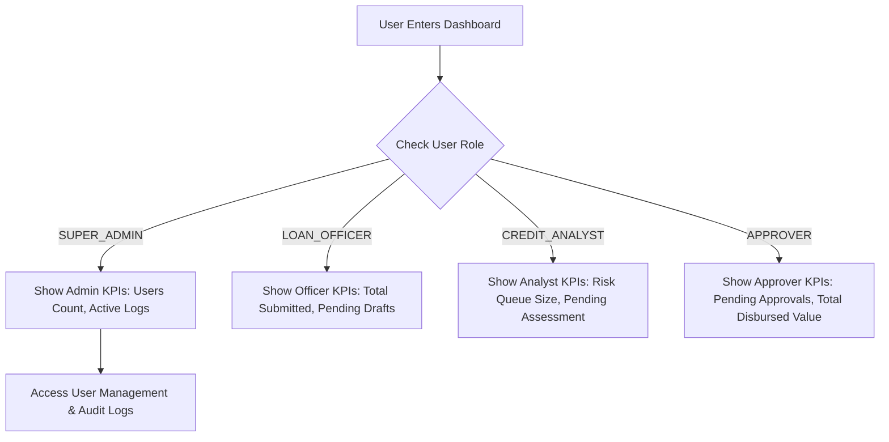
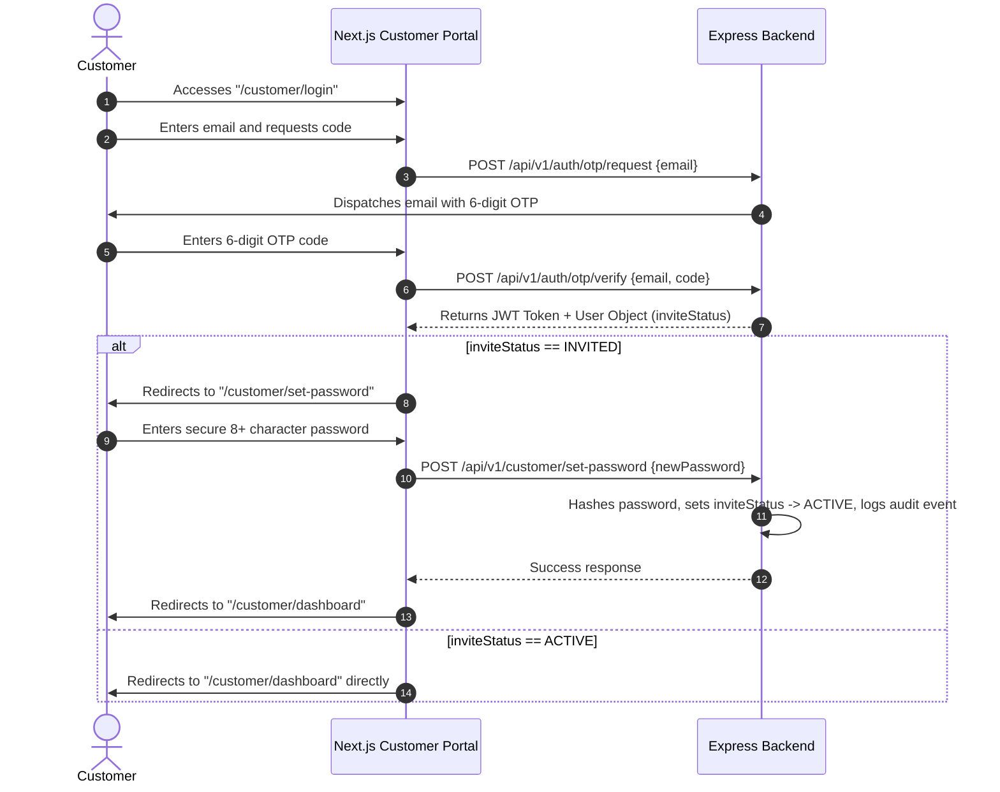
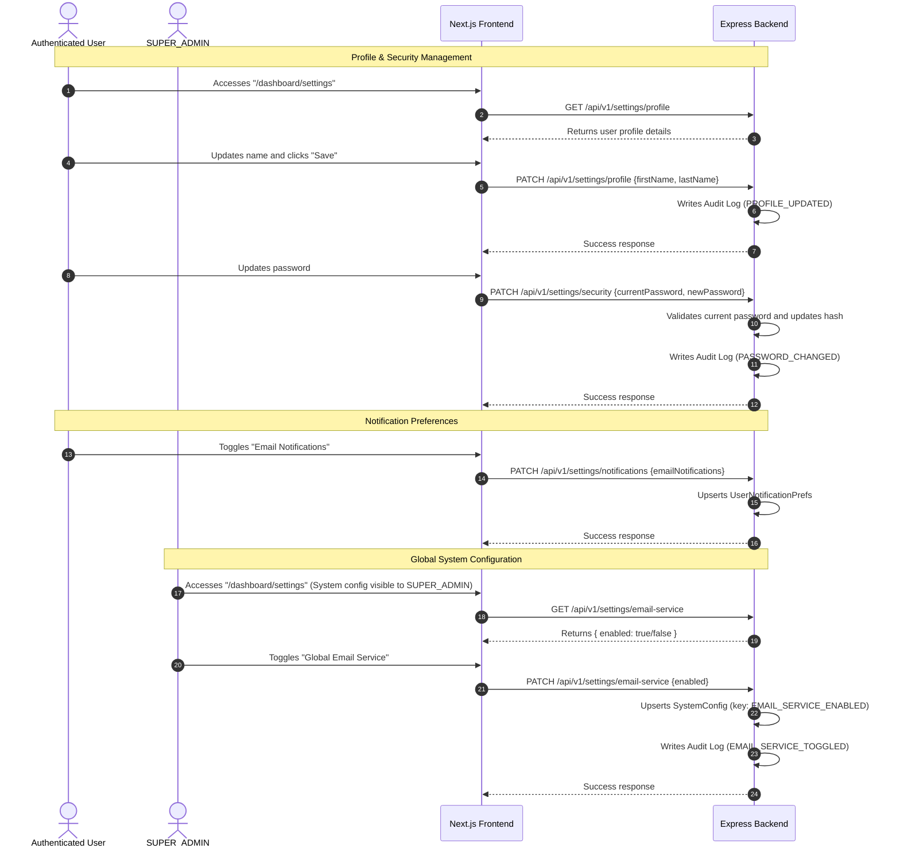

# User Flow Document - Loan Origination System (LOS)

This document describes the user interactions, access verification, and navigation paths implemented in the Loan Origination System (LOS).

---

## 1. Authentication Flow
This diagram details the sequence of steps from landing on the login page to accessing the dashboard.

---

## 2. Authorization & Dashboard Landing Flow
Once authenticated, the UI adapts dynamically based on the role stored in the JWT payload.

- **Role-Aware Sidebar**: The navigation component reads the role from the Auth context. Sidebar options are filtered dynamically based on access rights.
- **Client Route Protection**: If an unauthorized user attempts to enter a protected route (e.g. `/dashboard/users` for non-admins) directly, the page renders a 403 Access Denied layout.

---

## 3. Loan Application Lifecycle Flow (Phase 2)
The complete workflow sequence spanning three key roles (Loan Officer, Credit Analyst, Approver) to process a loan.

```mermaid
sequenceDiagram
  autonumber
  actor LO as Loan Officer
  actor CA as Credit Analyst
  actor AP as Approver
  participant FE as Next.js Frontend
  participant BE as Express Backend
  
  Note over LO, FE: 1. Origination Phase
  LO->>FE: Enters applicant profile (Name, PAN, income, etc)
  FE->>BE: POST /api/v1/applications (Create Draft)
  BE->>BE: Encrypts PAN (AES-256-GCM)
  BE->>BE: Writes Audit Log & status DRAFT history
  BE->>FE: Returns created application details
  
  LO->>FE: Selects document type & uploads scan file
  FE->>BE: POST /api/v1/documents (multipart/form-data)
  BE->>Cloudinary: Uploads file buffer securely
  Cloudinary-->>BE: Returns secureUrl & publicId
  BE->>BE: Writes Audit Log (DOCUMENT_UPLOADED)
  
  LO->>FE: Clicks "Submit Application"
  FE->>BE: POST /api/v1/applications/:id/submit
  BE->>BE: Updates status DRAFT -> SUBMITTED
  BE->>BE: Writes StatusHistory & Audit Log
  BE->>BE: Dispatches 'Application Submitted' Email via Nodemailer (async)
  
  Note over CA, FE: 2. Underwriting & Credit Assessment Phase
  CA->>FE: Selects application in Risk Queue
  FE->>BE: GET /api/v1/applications/:id
  BE->>BE: Decrypts & Masks PAN (e.g. *****) for Analyst
  BE->>FE: Returns details (masked PAN)
  
  CA->>FE: Clicks "Start Credit Review"
  FE->>BE: PUT /api/v1/applications/:id/status {status: UNDER_REVIEW}
  BE->>BE: Updates status SUBMITTED -> UNDER_REVIEW
  BE->>BE: Writes StatusHistory & Audit Log
  BE->>BE: Dispatches 'Application Under Review' Email via Nodemailer (async)
  BE->>BE: Automatically initializes PENDING Assessment & logs ASSESSMENT_CREATED
  
  CA->>FE: Reviews uploaded files (Verify/Reject document scans)
  FE->>BE: PUT /api/v1/documents/:docId/status {status: VERIFIED}
  BE->>BE: Writes Audit Log
  
  CA->>FE: Enters decision notes & clicks "Run Assessment"
  FE->>FE: Calculates score, risk profile, and recommendations client-side
  CA->>FE: Clicks "Save & Lock Assessment"
  FE->>BE: POST /api/v1/assessments {applicationId, assessmentNotes}
  BE->>BE: Derives final score/risk/recommendation, stores completed assessment
  BE->>BE: Logs ASSESSMENT_COMPLETED (No status history created)
  BE->>FE: Returns completed assessment record
  
  Note over AP, FE: 3. Final Sign-off, Offer Generation & Disbursement
  AP->>FE: Selects application in Approval Queue (Awaiting sign-off)
  AP->>FE: Clicks "Approve Loan"
  FE->>BE: PUT /api/v1/applications/:id/status {status: APPROVED}
  BE->>BE: Enforces Approval Guard (completed assessment must exist)
  BE->>BE: Updates status UNDER_REVIEW -> APPROVED
  BE->>BE: Writes StatusHistory & Audit Log
  
  AP->>FE: Enters interest rate, tenure, and clicks "Generate Offer"
  FE->>BE: POST /api/v1/offers/generate {applicationId, interestRate, tenureMonths}
  BE->>BE: Calculates EMI/repayments & sets expiresAt (7 days validity)
  BE->>BE: Updates status APPROVED -> OFFER_GENERATED
  BE->>BE: Writes StatusHistory & Audit Log (OFFER_GENERATED)
  BE->>BE: Dispatches 'Loan Offer Generated' Email via Nodemailer (async)
  BE->>BE: Creates customer portal notification (Your Loan Offer is Ready)
  
  Note over User, FE: 4. Customer Self-Service & Offer Acceptance
  User->>FE: Receives invitation email, logs in with temp code/OTP
  FE->>FE: Detects inviteStatus = INVITED, prompts password setup
  User->>FE: Submits password, transitions inviteStatus -> ACTIVE
  User->>FE: Reviews status tracker and next actions in Action Center
  User->>FE: Goes to "My Offer" tab/page, reviews interest rate and EMI
  User->>FE: Downloads Sanction Letter text/PDF
  User->>FE: Clicks "Accept & Agree" (or Decline)
  FE->>BE: POST /api/v1/customer/applications/:id/offer/accept
  BE->>BE: Checks offer expiry
  BE->>BE: Transactional: updates offer status to ACCEPTED, loan status to OFFER_ACCEPTED, status history
  BE->>BE: Writes Audit Log (CUSTOMER_OFFER_ACCEPTED) and customer notification
  
  Note over AP, FE: 5. Fund Disbursement Phase
  AP->>FE: Selects application in status OFFER_ACCEPTED
  AP->>FE: Reviews EMI terms, clicks "Disburse Funds"
  FE->>BE: POST /api/v1/disbursements {applicationId}
  BE->>BE: Generates reference: TXN-YYYYMMDD-XXXXXX
  BE->>BE: Creates Disbursement record (SUCCESS)
  BE->>BE: Updates status OFFER_ACCEPTED -> DISBURSED
  BE->>BE: Writes StatusHistory & Audit Log (LOAN_DISBURSED)
  BE->>BE: Dispatches 'Loan Disbursed' Email via Nodemailer (async)
  BE->>BE: Creates customer portal notification (Funds Disbursed)
  FE->>AP: Shows disbursement transaction details and status badge
  
  Note over User, FE: 6. Repayment Tracking
  User->>FE: Refreshes portal dashboard or tracks application detail
  FE->>FE: Sees status "Funds Disbursed", accesses "Repayment" tab
  FE->>FE: Renders interactive repayment schedule (due dates, principal, interest)
```

---

## 4. Customer Portal Login & Password Setup Flow
A detailed view of the customer verification login flow:

---

## 5. Settings & Profile Management Flow
This flow details how users can manage their personal profiles, security, notifications, and how a SUPER_ADMIN can toggle the global email service.

